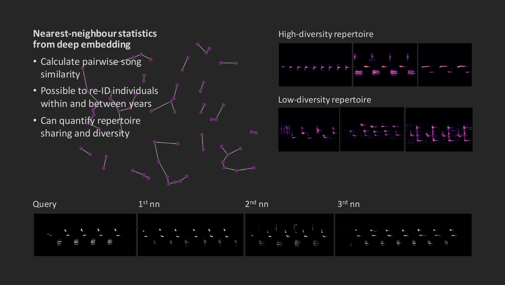

# Training ML models

`pykanto` can be used to organise and export data to train any model, and the
output (for example, similarity scores) can be imported back into the
dataset, which provides a convenient way of keeping every step of the project
together.

There is a complete example in [the article presenting `pykanto`](https://arxiv.org/pdf/2302.10340v1.pdf) that
walks you through the steps of training a 'deep learning' model to differentiate
between different birds based on their songs. The code to run this example,
which you can easily adapt and reuse with your own data, is available in its own
repository: [nilomr/pykanto-example](https://github.com/nilomr/pykanto-example).
In particular, scripts 3 and 4 demonstrate how easy it is to generate training
and testing sets from the data in a `pykanto` dataset, and how to fine-tune a fairly
powerful model using PyTorch and Pytorch-Lightning.

 

