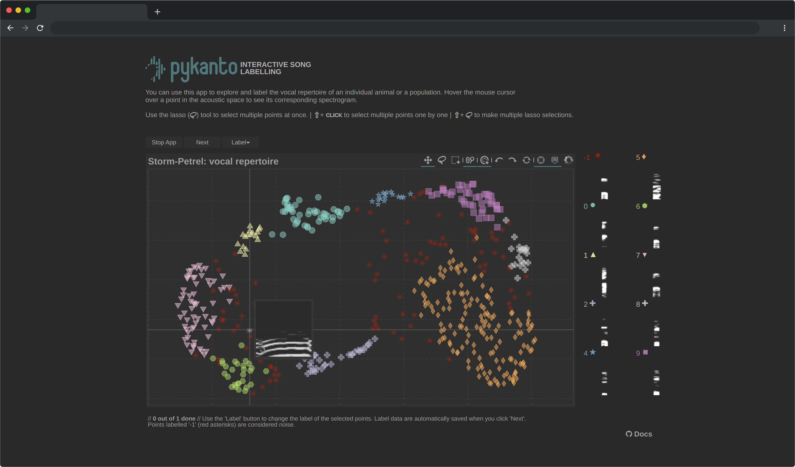

# Interactive app

`pykanto` includes a web application that allows you to interactively explore
your data. It can be launched using a method from the `KantoData` class:

```python
dataset.open_label_app()
```

This will open a new tab in your browser: you can follow the instructions in the app to explore and label your data.



Once you are done checking the automatically assigned labels you need to reload
the updated dataset, which has been automatically saved to disk:

```python
dataset = dataset.reload()
```

````{admonition} Note:
:class: note

Running the web application requires having run the following methods on your `KantoData` object:

```python
dataset.segment_into_units()
dataset.get_units()
dataset.cluster_ids()
dataset.prepare_interactive_data()
```

In short, these find distinct units in each vocalisation, label them, and create lightweight representations of the sounds, see the entire process in the [basic workflow page](./basic-workflow.ipynb) for more details.
````

You can also use the app to check and correct labels assigned through any other
means, for example after training a deep learning classifier model. To do this,
you simply need to add your custom labels to the dataframe containing your data.

For example, if your {py:class}`~pykanto.dataset.KantoData` object is called `dataset`, you
can overwrite the `auto_class` column in `dataset.data` with your own labels
(str). This will work when `dataset.parameters.song_level = True`; if you want
to do this at the note or unit level please open an issue on GitHub and I'll add
this functionality.
